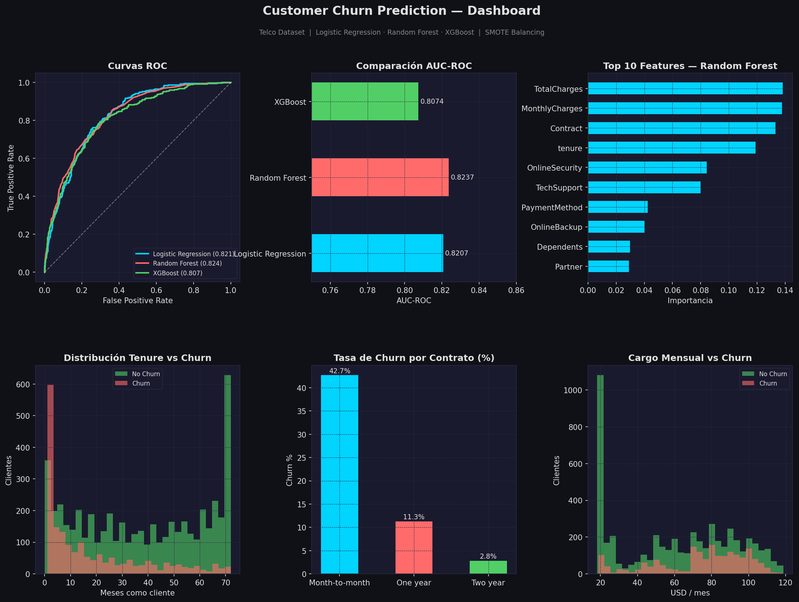

# 🔍 Customer Churn Prediction

Modelo de Machine Learning para predecir fuga de clientes en el sector telecomunicaciones.
Compara tres algoritmos (Logistic Regression, Random Forest, XGBoost) con balanceo de clases mediante SMOTE.



---

## 📊 Resultados

| Modelo | AUC-ROC | Recall Churn |
|---|---|---|
| Logistic Regression | 0.8207 | 0.71 |
| Random Forest | **0.8237** | 0.58 |
| XGBoost | 0.8074 | 0.61 |

> ✅ Mejor modelo: **Random Forest** (AUC: 0.8237 con SMOTE)

---

## 💡 Insights del negocio

- Clientes con contrato **mes a mes** tienen una tasa de churn del **42.7%** vs 2.8% en contratos de 2 años
- Los primeros **12 meses** son críticos — la mayoría de fugas ocurre en ese período
- **TotalCharges, MonthlyCharges y tenure** son las variables con mayor poder predictivo
- Clientes que pagan más de **$60/mes** tienen mayor probabilidad de fuga

---

## 🗂️ Estructura del proyecto
churn-predictor/
├── data/
│   └── WA_Fn-UseC_-Telco-Customer-Churn.csv
├── models/
│   ├── best_model.pkl
│   └── best_model_smote.pkl
├── src/
│   ├── eda.py
│   ├── preprocessing.py
│   ├── train.py
│   ├── train_smote.py
│   └── dashboard.py
├── reports/
│   ├── churn_eda.png
│   ├── confusion_matrix.png
│   ├── confusion_matrix_smote.png
│   └── dashboard.png
└── README.md

---

## ⚙️ Cómo ejecutar

### 1. Clona el repositorio
```bash
git clone https://github.com/tu-usuario/churn-predictor.git
cd churn-predictor
```

### 2. Instala las dependencias
```bash
pip install -r requirements.txt
```

### 3. Ejecuta en orden
```bash
python src/eda.py
python src/preprocessing.py
python src/train.py
python src/train_smote.py
python src/dashboard.py
```

---

## 🛠️ Stack

- **Python 3.11**
- **pandas / numpy** — manipulación de datos
- **scikit-learn** — modelos y métricas
- **XGBoost** — gradient boosting
- **imbalanced-learn** — SMOTE
- **matplotlib / seaborn** — visualizaciones

---

## 📁 Dataset

[Telco Customer Churn — Kaggle](https://www.kaggle.com/datasets/blastchar/telco-customer-churn)

7,043 clientes con 21 variables: datos demográficos, servicios contratados, facturación y churn.

---

## 👩‍💻 Autora

**Karla Altamirano** — Software Engineer & Digital Transformation Specialist  
[LinkedIn](https://www.linkedin.com/in/karlaemilia99) 